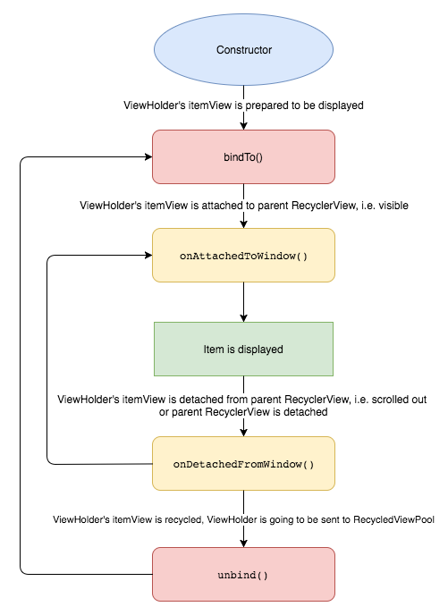

[  ](https://bintray.com/trading-212/maven/diverse-recycler-adapter/_latestVersion)

# Diverse Recycler Adapter

**DiverseRecyclerAdapter** is a small and yet powerful library, which greatly simplifies building lists of different(as well as single type) items, by breaking each item type into separate class called `RecyclerItem`. This way the complexity of supporting multiple item types is moved out of the adapter, which makes the code easier to write, easier to maintain and better encapsulated. DiverseRecyclerAdapter provides a set of useful functions which do everything you would want to do with a list - add, insert, move, remove, find item(s).

As of version `0.9` **DiverseRecyclerAdapter** supports multiple or single item selection by having the RecyclerItem's `ViewHolder` implement a single interface and setting `SelectionMode` to the adapter. Item selection is designed to avoid calling `notify*Changed` on selection sate change, which causes some or all visible items to be rebound(detach->*unbind*->bind->attach), instead, DiverseRecyclerAdapter handles selection state changes internally, by calling `Selectable.updateSelectionState(Boolean)` only to the items which selection state has changed, which greatly improves the RecyclerView performance, especially when item's UI consists of complex and/or heavy hierarchies.
*See `SingleSelectionListActivity` and `MultipleSelectionListActivity` in the demo module for implementation details*

Version `0.9` also adds support and greatly simplifies *Drag to Reorder* UX pattern. You only need to implement `Draggable` interface in the RecyclerItem's `ViewHolder` and set `DragItemTouchHelperCallback` as callback to Android's `ItemTouchHelper` class. 
*See `DragToReorderActivity` in the demo for implementation details*

*Written in Kotlin, with full Java interoperability*

## Installation

```implementation 'com.trading212:diverse-recycler-adapter:0.9.9'```

## Getting Started

### ViewHolder

The well-known `ViewHolder` pattern. For more details see [Android Documentation](https://developer.android.com/reference/android/support/v7/widget/RecyclerView.ViewHolder.html).

```java
public class ViewHolder extends DiverseRecyclerAdapter.ViewHolder<String> {

    private TextView textView;

    public ViewHolder(@NotNull View itemView) {
        super(itemView);

        textView = findViewById(R.id.textView);
    }

    @Override
    protected void bindTo(@Nullable String data) {
        textView.setText(data);
    }
}
```

#### ViewHolder lifecycle



`ViewHolder.bindTo()`, `ViewHolder.onAttachedToWindow()` and `ViewHolder.onDetachedFromWindow()` are guaranteed to be called, while `ViewHolder.unbind()` is called only when the `ViewHolder` is going to be recycled(pushed to recycler view pool), i.e. prepared to be bound to another `RecyclerItem`, which may never happen. Thus, if you want to be sure that all resources are released as early as possible, you should use `ViewHolder.onDetachedFromWindow()` for that purpose. 

**Note:** Use `DiverseLinearLayoutManager`, `DiverseGridLayoutManager`, `DiverseStaggeredGridLayoutManager()` or a subclass in the hosting `RecyclerView.setLayoutManager()` in order to have `ViewHolder`'s attach/detach events work correctly. Otherwise `ViewHolder.onDetachedFromWindow()` will not be called when the hosting `RecyclerView` is detached from it's parent. Alternatively, you can use any subclass of `LayoutManager` and delegate `LayoutManager.onAttachedToWindow()` and `LayoutManager.onDetachedFromWindow()` events to `delegateRecyclerViewAttachedToWindow()` and `delegateRecyclerViewDetachedFromWindow()` respectively, which are located in `LayoutManagerUtil` class(Java only).

### RecyclerItem

The `RecyclerItem` class describes a category(all items of the same type) in the adapter. It contains the data about a single item, as well as factory method for creating `ViewHolder`s for that category.

```java
public class SimpleTextRecyclerItem extends DiverseRecyclerAdapter.RecyclerItem<String, ViewHolder> {

    public static final int TYPE = 1;

    private String text;

    public SimpleTextRecyclerItem(String text) {
        this.text = text;
    }

    @Override
    public int getType() {
        return TYPE;
    }

    @Nullable
    @Override
    public String getData() {
        return text;
    }

    @NotNull
    @Override
    protected ViewHolder createViewHolder(@NotNull ViewGroup parent, @NotNull LayoutInflater inflater) {
        return new ViewHolder(inflater.inflate(R.layout.item_simple_text, parent, false));
    }
}

```

### Working with DiverseRecyclerAdapter

- Add item
```java
adapter.addItem(new SimpleTextRecyclerItem("Item Text"));
```
- Add multiple items
```java
List<SimpleTextRecyclerItem> items = new ArrayList<>(30);
for (int i = 0; i < 30; i++) {
    items.add(new SimpleTextRecyclerItem("Item " + i));
}  
adapter.addItems(items);
```
- Insert item
```java
adapter.insertItem(5, new SimpleTextRecyclerItem("Item Text"));
```
- Insert multiple items
```java
List<SimpleTextRecyclerItem> items = new ArrayList<>(30);
for (int i = 0; i < 30; i++) {
    items.add(new SimpleTextRecyclerItem("Item " + i));
}  
adapter.insertItems(5, items);
```
- Move item
```java
adapter.moveItem(3, 4);
```
- Remove item
```java
adapter.removeItem(4);
```
- Remove range
```java
adapter.removeRange(0, 5);
```
- Remove all items
```java
adapter.removeAll();
```
- Find the adapter position of the first `RecyclerItem` with the specified type, i.e. the position of the first item of a category
```java
adapter.findFirstItemTypePosition(SimpleTextRecyclerItem.TYPE);
```
- Find the adapter position of the last `RecyclerItem` with the specified type, i.e. the position of the last item of a category
```java
adapter.findLastItemTypePosition(SimpleTextRecyclerItem.TYPE);
```
- Get a reference to `RecyclerItem` by position
```java
if (adapter.getItemViewType(4) == SimpleTextRecyclerItem.TYPE) {
    SimpleTextRecyclerItem textRecyclerItem = adapter.getItem(4);
}
````
- Handle `itemView` events
```java
adapter.setOnItemActionListener(new DiverseRecyclerAdapter.OnItemActionListener() {
    @Override
    public void onItemClicked(@NotNull View v, int position) {
        // Handle itemView click
    }
    
    @Override
    public boolean onItemLongClicked(@NotNull View v, int position) {
        // Handle itemView long click 
        return super.onItemLongClicked();
    }
    
    @Override
    public boolean onItemTouched(@NotNull View v, @NotNull MotionEvent event, int position) {
        // Handle itemView touch events
        return super.onItemTouched(v, event, position);
    }
});
```

*For more details, explore and run the **demo** module, as well as the library itself*

## License

Copyright 2019 Trading 212 Ltd.

Licensed under the Apache License, Version 2.0 (the "License");
you may not use this file except in compliance with the License.
You may obtain a copy of the License at

    http://www.apache.org/licenses/LICENSE-2.0

Unless required by applicable law or agreed to in writing, software
distributed under the License is distributed on an "AS IS" BASIS,
WITHOUT WARRANTIES OR CONDITIONS OF ANY KIND, either express or implied.
See the License for the specific language governing permissions and
limitations under the License.
